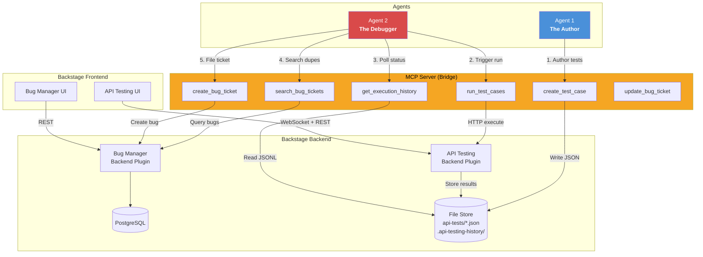
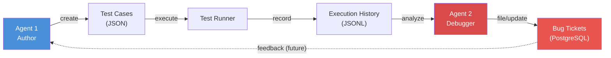
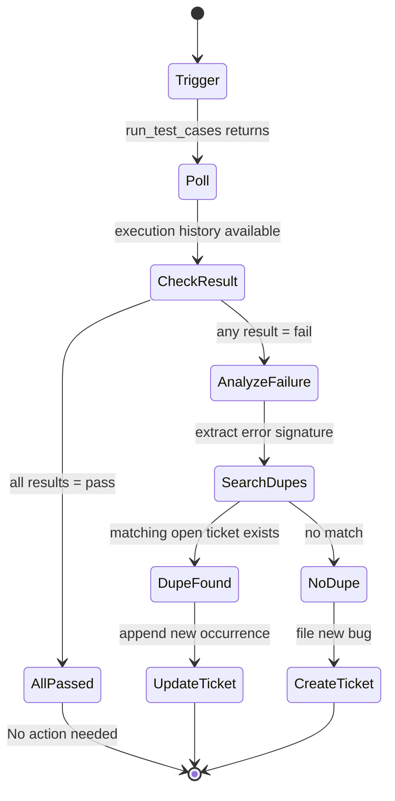
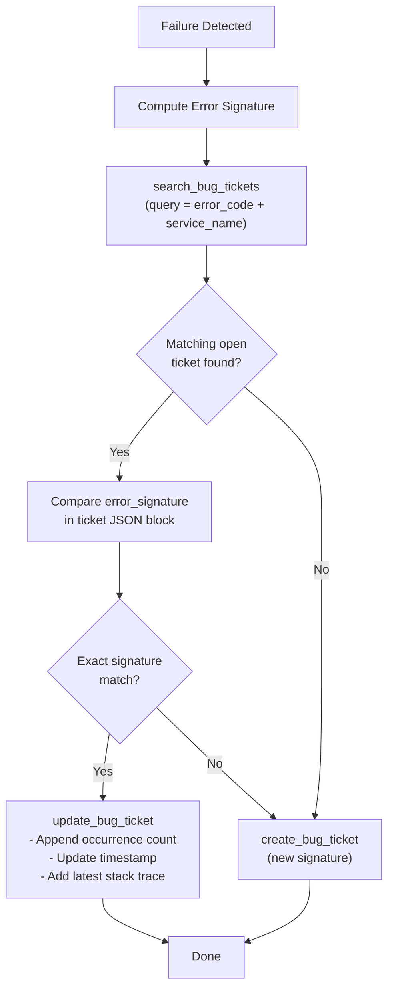
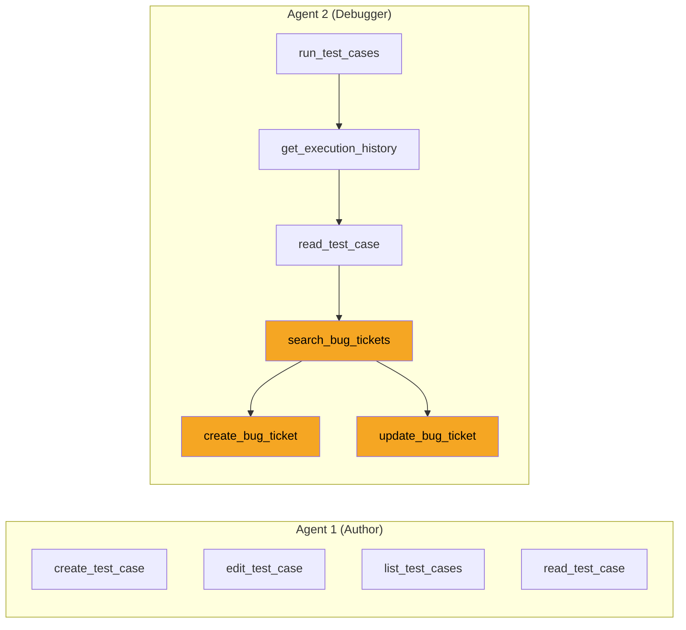
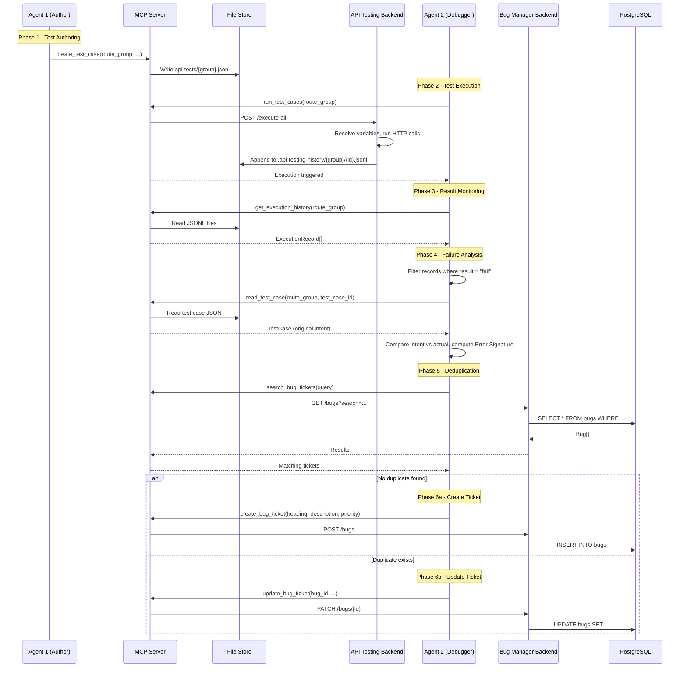

# Closed-Loop Automated Testing & Bug Reporting System

| Field          | Value                                       |
| -------------- | ------------------------------------------- |
| **Status**     | Draft                                       |
| **Author**     | Solutions Architecture                      |
| **Date**       | 2026-02-26                                  |
| **Plugin IDs** | `api-testing`, `api-testing-mcp-server`, `bug-manager` |
| **Version**    | 1.0                                         |

---

## Table of Contents

1. [Executive Summary](#1-executive-summary)
2. [System Architecture](#2-system-architecture)
3. [Agent Roles](#3-agent-roles)
4. [Agent 2 Workflow (The Debugger)](#4-agent-2-workflow-the-debugger)
5. [Intelligent Bug Reporting & Deduplication](#5-intelligent-bug-reporting--deduplication)
6. [Bug Ticket Specification](#6-bug-ticket-specification)
7. [Required MCP Tools](#7-required-mcp-tools)
8. [Data Flow Reference](#8-data-flow-reference)
9. [Constraints & Assumptions](#9-constraints--assumptions)

---

## 1. Executive Summary

Today the API Testing and Bug Manager plugins operate independently inside Backstage. An agent (or a human) can author test cases and execute them, and a separate team can file bugs manually. This specification defines the **closed-loop** integration that connects the two: an AI agent authors tests, a second AI agent runs them, and any failures are automatically triaged into the Bug Manager with full deduplication and structured metadata.

### Key Changes

| Aspect              | Current (Open-Loop)                          | Target (Closed-Loop)                                      |
| ------------------- | -------------------------------------------- | --------------------------------------------------------- |
| Test authoring      | Manual or single-agent via MCP               | **Agent 1 (The Author)** generates JSON test configs      |
| Test execution      | Manual trigger from UI or single MCP call     | **Agent 2 (The Debugger)** triggers, monitors, and reacts |
| Failure handling    | Human reads execution history                | Agent 2 analyzes failures against original test intent     |
| Bug reporting       | Manual ticket creation                       | Automated ticket creation with deduplication               |
| Feedback loop       | None                                         | Bug status feeds back into future test prioritization      |

---

## 2. System Architecture

### 2.1 High-Level Component Diagram



### 2.2 Unidirectional to Closed-Loop Transition

The current system is **unidirectional**: test cases flow in one direction from creation to execution to manual review.

```
Author --> Test Cases --> Execution --> History --> (Human reviews)
```

The closed-loop system introduces **feedback arcs** at two points:

1. **Execution-to-Bug Arc** -- When Agent 2 detects a failure, it automatically files a structured bug ticket in the Bug Manager, linking the original test intent to the observed failure.
2. **Bug-to-Test Arc** (future) -- Open bugs can inform Agent 1 about which endpoints are fragile, enabling prioritized re-testing or regression suite generation.



### 2.3 MCP Server as the Bridge

The MCP Server (`api-testing-mcp-server`) is the single integration surface between AI agents and Backstage. Agents never call Backstage APIs directly; all interactions are mediated through MCP tools over **stdio transport**.

Current MCP tools (`list_test_cases`, `read_test_case`, `create_test_case`, `edit_test_case`, `delete_test_case`, `run_test_cases`, `get_execution_history`) will be extended with bug-management tools (`search_bug_tickets`, `create_bug_ticket`, `update_bug_ticket`) to complete the closed loop.

---

## 3. Agent Roles

### Agent 1 -- The Author

| Property        | Detail                                                              |
| --------------- | ------------------------------------------------------------------- |
| **Purpose**     | Generate and maintain test configurations in JSON format            |
| **Input**       | API specification, OpenAPI docs, or natural-language service description |
| **Output**      | Test cases written via `create_test_case` MCP tool                  |
| **Initiator ID**| `agent:author`                                                      |
| **MCP Tools Used** | `create_test_case`, `edit_test_case`, `list_test_cases`, `read_test_case` |

Agent 1 produces test cases that conform to the existing `TestCase` schema:

```jsonc
{
  "route_group": "/v1/orders",
  "name": "Create order with valid payload",
  "method": "POST",
  "path": "/v1/orders",
  "headers": { "Authorization": "Bearer ${auth_token}" },
  "body": { "item_id": "SKU-001", "quantity": 2 },
  "assertions": {
    "status_code": 201,
    "body_contains": { "status": "created" },
    "body_schema": { "required_fields": ["id", "status", "created_at"] }
  }
}
```

### Agent 2 -- The Debugger

| Property        | Detail                                                              |
| --------------- | ------------------------------------------------------------------- |
| **Purpose**     | Execute tests, analyze failures, and manage bug lifecycle           |
| **Input**       | Test cases authored by Agent 1; execution history from the runner   |
| **Output**      | Bug tickets filed in the Bug Manager                                |
| **Initiator ID**| `agent:debugger`                                                    |
| **MCP Tools Used** | `run_test_cases`, `get_execution_history`, `read_test_case`, `search_bug_tickets`, `create_bug_ticket`, `update_bug_ticket` |

---

## 4. Agent 2 Workflow (The Debugger)

Agent 2 follows a strict sequential pipeline for each test run cycle.



### Step 1: Triggering

Agent 2 initiates a test run for a specific route group using the `run_test_cases` MCP tool.

```jsonc
// MCP tool call
{
  "tool": "run_test_cases",
  "arguments": {
    "route_group": "/v1/orders",
    // Optional: run only specific test cases
    "test_case_ids": ["tc_create_order_valid", "tc_create_order_missing_item"],
    // Optional: override variables for this run
    "variable_overrides": {
      "auth_token": "agent-provided-token"
    }
  }
}
```

The MCP server delegates execution to the API Testing Backend, which:
- Resolves environment variables and setup steps (auth tokens, data seeding).
- Fires HTTP requests (or spawns `pytest` for flow tests).
- Appends `ExecutionRecord` entries to JSONL history files.
- Tags the `initiator` field as `"agent"` with `agent_identity: "debugger"`.

### Step 2: Monitoring (Polling for Completion)

After triggering, Agent 2 polls for results using `get_execution_history`.

```jsonc
{
  "tool": "get_execution_history",
  "arguments": {
    "route_group": "/v1/orders",
    "limit": 20
  }
}
```

**Polling strategy:**
1. Wait a brief interval after triggering (execution is typically fast for HTTP tests).
2. Query `get_execution_history` filtered to the route group.
3. Match returned records by timestamp proximity to the trigger time.
4. If the expected number of results is not yet available, retry with backoff.

For **flow tests** (pytest-based), execution may take longer. Agent 2 should use a wider polling window (up to 5 minutes) before treating the run as timed out.

### Step 3: Failure Analysis

For each `ExecutionRecord` where `result === "fail"`, Agent 2 performs root-cause analysis by comparing:

| Source                  | Contains                                        |
| ----------------------- | ----------------------------------------------- |
| **Test Intent (JSON)**  | Expected status code, body assertions, required fields |
| **Execution Record**    | Actual status code, response body, failure_reason |
| **Flow Step Log** (if flow test) | Per-step pass/fail, stdout, stderr, stack traces |

**Analysis logic:**

```
1. Read the original test case via `read_test_case` to get the full assertion spec.
2. Compare assertion.status_code vs response.status_code.
3. Compare assertion.body_contains keys vs actual response body.
4. Compare assertion.body_schema.required_fields vs actual response keys.
5. Parse failure_reason for error patterns (HTTP error codes, exception types).
6. For flow tests: walk flow_step_log.steps to identify the first failing step.
7. Construct an "Error Signature" (see Section 5).
```

### Step 4: Bug Filing or Update

Based on the deduplication check (Section 5), Agent 2 either creates a new ticket or updates an existing one. The ticket format is defined in Section 6.

---

## 5. Intelligent Bug Reporting & Deduplication

### 5.1 Error Signature

Every failure is reduced to an **Error Signature** -- a composite key used for identity matching across bug tickets.

```
ErrorSignature = hash(service_name + error_code + endpoint_path + failure_category)
```

| Component           | Source                                          | Example                  |
| ------------------- | ----------------------------------------------- | ------------------------ |
| `service_name`      | Route group prefix                              | `orders-service`         |
| `error_code`        | HTTP status or exception type                   | `500`, `ConnectionError` |
| `endpoint_path`     | Test case `path` field                          | `/v1/orders`             |
| `failure_category`  | Classified type: `status_mismatch`, `body_mismatch`, `schema_violation`, `timeout`, `connection_error` | `status_mismatch` |

The signature is embedded in the bug ticket description (in the AI-readable JSON block) and used for search queries.

### 5.2 Deduplication Flow



### 5.3 Identity Check Protocol

Before creating any ticket, Agent 2 **must** execute the following:

1. **Query** `search_bug_tickets` with the service name and error code as search terms.
2. **Filter** results to only open tickets (`isClosed === false`).
3. **Parse** the `<!-- AI_METADATA -->` JSON block from each candidate ticket's description.
4. **Compare** the `error_signature` field against the computed signature.
5. **Decision:**
   - **Exact match found** -- Call `update_bug_ticket` to append a new occurrence entry.
   - **No match** -- Call `create_bug_ticket` with the full ticket template.

---

## 6. Bug Ticket Specification

Every ticket created by Agent 2 must conform to the following template. The ticket body is a single Markdown string stored in the Bug Manager's `description` field.

### 6.1 Heading Format

```
[{Result}] {ServiceName}: {ErrorType} on {Method} {Path}
```

**Examples:**
- `[Fail] orders-service: 500 Internal Server Error on POST /v1/orders`
- `[Fail] auth-service: Timeout on GET /v1/users/me`
- `[Fail] payments-service: Schema Violation on POST /v1/payments`

### 6.2 Ticket Body Template

```markdown
## Summary

{One-sentence plain-English description of what failed and why it matters.}

## Reproduction Context

- **Service:** {service_name}
- **Endpoint:** `{method} {path}`
- **Environment:** {environment_name}
- **Test Case:** `{test_case_id}` -- "{test_case_name}"
- **Triggered By:** Agent 2 (Debugger)
- **Timestamp:** {ISO 8601 timestamp}
- **Occurrence Count:** {n}

## Failure Details

**Expected:** Status {expected_status}, body containing `{expected_body_keys}`
**Actual:** Status {actual_status}

```text
{failure_reason or first 50 lines of stack trace}
```

## Suggested Fix

{AI-generated hypothesis on the root cause and recommended remediation steps.
This should reference specific fields from the request/response where the
divergence occurred.}

---

<!-- AI_METADATA
```json
{
  "error_signature": "{computed_signature}",
  "service_name": "{service_name}",
  "error_code": "{status_code_or_exception}",
  "failure_category": "{status_mismatch|body_mismatch|schema_violation|timeout|connection_error}",
  "endpoint": "{method} {path}",
  "test_case_id": "{test_case_id}",
  "route_group": "{route_group}",
  "occurrences": [
    {
      "timestamp": "{ISO 8601}",
      "execution_record_id": "{record_id}",
      "request": {
        "method": "{method}",
        "url": "{full_url}",
        "headers": {},
        "body": {}
      },
      "response": {
        "status_code": 500,
        "headers": {},
        "body": {}
      },
      "failure_reason": "{raw failure_reason string}",
      "flow_step_log": null
    }
  ]
}
```
-->
```

### 6.3 Field Mapping to Bug Manager Schema

| Ticket Field       | Bug Manager Column | Value                                          |
| ------------------ | ------------------ | ---------------------------------------------- |
| Heading            | `heading`          | `[Fail] {service}: {error} on {method} {path}` |
| Body               | `description`      | Full Markdown template above                   |
| Priority           | `priority`         | `urgent` for 5xx, `medium` for 4xx/schema, `low` for timeouts |
| Status             | `status_id`        | Mapped to "Open" status                        |
| Assignee           | `assignee_id`      | `null` (unassigned on creation)                |
| Reporter           | `reporter_id`      | Agent's Backstage identity                     |

---

## 7. Required MCP Tools

### 7.1 Existing Tools (No Changes)

These tools are already implemented in `api-testing-mcp-server` and require no modification:

| Tool                   | Purpose                                     |
| ---------------------- | ------------------------------------------- |
| `list_test_cases`      | List all test cases in a route group        |
| `read_test_case`       | Read a single test case by ID               |
| `create_test_case`     | Create a new test case (Agent 1)            |
| `edit_test_case`       | Edit an existing test case (Agent 1)        |
| `delete_test_case`     | Remove a test case                          |
| `run_test_cases`       | Execute test cases and record results       |
| `get_execution_history`| Fetch execution records for analysis        |

### 7.2 New Tools (To Be Implemented)

These tools bridge the API Testing MCP Server to the Bug Manager Backend.

#### `search_bug_tickets`

Queries the Bug Manager for existing tickets matching a search criteria. Used by Agent 2 for deduplication.

```typescript
server.tool(
  'search_bug_tickets',
  'Search existing bug tickets for deduplication. Returns open tickets matching the query.',
  {
    query: z.string().describe('Search string (e.g., "500 orders-service")'),
    include_closed: z.boolean().optional().default(false)
      .describe('Whether to include closed tickets in results'),
    limit: z.number().optional().default(20)
      .describe('Maximum number of results'),
  },
  async (params) => { /* ... */ }
);
```

**Implementation:** HTTP GET to Bug Manager Backend `GET /api/bug-manager/bugs?search={query}&includeClosed={include_closed}`.

#### `create_bug_ticket`

Creates a structured bug ticket in the Bug Manager.

```typescript
server.tool(
  'create_bug_ticket',
  'Create a new bug ticket in the Bug Manager with structured metadata.',
  {
    heading: z.string().describe('Ticket heading: [Fail] {Service}: {Error} on {Method} {Path}'),
    description: z.string().describe('Full Markdown body including AI_METADATA block'),
    priority: z.enum(['urgent', 'medium', 'low']).describe('Ticket priority'),
  },
  async (params) => { /* ... */ }
);
```

**Implementation:** HTTP POST to Bug Manager Backend `POST /api/bug-manager/bugs`.

#### `update_bug_ticket`

Appends a new occurrence to an existing bug ticket's metadata block.

```typescript
server.tool(
  'update_bug_ticket',
  'Update an existing bug ticket with a new failure occurrence.',
  {
    bug_id: z.string().describe('ID of the existing bug ticket'),
    additional_occurrence: z.string()
      .describe('JSON string of the new occurrence object to append'),
    updated_description: z.string()
      .describe('Full updated Markdown body with appended occurrence'),
  },
  async (params) => { /* ... */ }
);
```

**Implementation:** HTTP PATCH to Bug Manager Backend `PATCH /api/bug-manager/bugs/{bug_id}`.

### 7.3 Tool Dependency Graph



Tools highlighted in orange are **new** and must be implemented.

---

## 8. Data Flow Reference

### 8.1 End-to-End Sequence



### 8.2 File System Layout

```
backstage/
  api-tests/
    v1-orders.json              # Test cases for /v1/orders
    v1-users.json               # Test cases for /v1/users
  .api-testing-history/
    v1-orders/
      tc_create_order.jsonl     # Per-endpoint execution history
      tc_get_order.jsonl
    v1-users/
      tc_get_user.jsonl
  plugins/
    api-testing-mcp-server/
      src/
        tools/
          runTestCases.ts       # Existing
          searchBugTickets.ts   # NEW
          createBugTicket.ts    # NEW
          updateBugTicket.ts    # NEW
```

---

## 9. Constraints & Assumptions

### 9.1 Constraints

| Constraint                      | Detail                                                    |
| ------------------------------- | --------------------------------------------------------- |
| MCP Transport                   | stdio only; agents connect via `npx tsx` subprocess       |
| Bug Manager Auth                | MCP server must authenticate as a Backstage service user  |
| Max Active Statuses             | Bug Manager enforces exactly 5 active statuses            |
| History Granularity             | Execution history is tracked per individual test case, not per route group |
| Ticket Size                     | Description field must stay under 64 KB (PostgreSQL text) |
| No Direct API Calls             | Agents must never call Backstage REST APIs directly; all interactions go through MCP tools |

### 9.2 Assumptions

1. **Agent 1 and Agent 2 operate independently.** They do not share state or communicate directly. The file store (test cases + history) is the shared medium.
2. **The Bug Manager Backend is running and migrated.** PostgreSQL with the `bugs`, `bug_statuses`, and `bug_comments` tables must be available.
3. **Agent identity is resolvable.** The MCP server must be able to authenticate against Backstage's `httpAuth` service to create tickets with a valid `reporter_id`.
4. **Error signatures are deterministic.** The same failure on the same endpoint with the same error code must always produce the same signature, regardless of timestamp or payload variations.

### 9.3 Success Criteria

- [ ] Agent 2 can trigger a full test suite via `run_test_cases` and receive structured results.
- [ ] Agent 2 correctly identifies failures and computes error signatures.
- [ ] `search_bug_tickets` returns relevant open tickets matching an error signature.
- [ ] No duplicate tickets are created for the same recurring failure.
- [ ] `create_bug_ticket` produces tickets conforming to the template in Section 6.
- [ ] `update_bug_ticket` correctly appends occurrence data without corrupting the Markdown structure.
- [ ] The full Author-to-Debugger pipeline runs end-to-end without human intervention.
